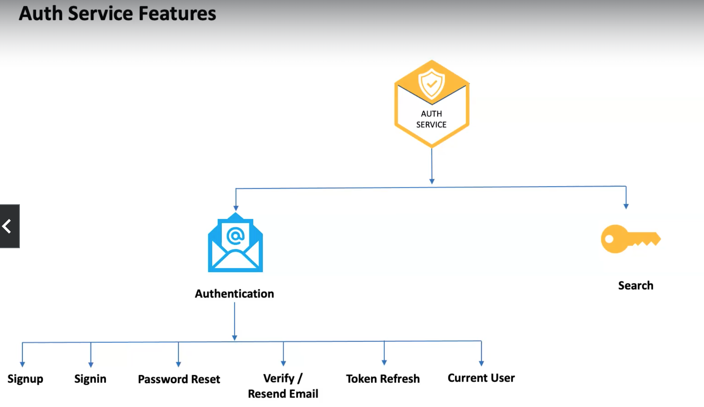

# 3-auth-service

The authentication service is responsible for authenticating users in our application.

This authentication service is used to generate the Json web token. And then it will be sent to the API gateway.

Then it's in the API gateway that we are going to save the JWT token in the cookie session.

This authentication service have some features. These features are `authentication` feature and a `search` feature.

##### Auth Service Features

Now the other feature is going to be the search feature.

For the search, users are able to search for `gigs` even though they are not authenticated. When users search for `gigs`, they are not able to purchase any gig until they authenticated, but they are able to search for gigs.

**Note:** that the gigs that users create are stored/saved to `Elasticsearch` and also to `MongoDB`. So the search for retrieving data(gigs), are **ONLY** from `Elasticsearch` ie the search service would be to retrieve/get data from `Elasticsearch`.